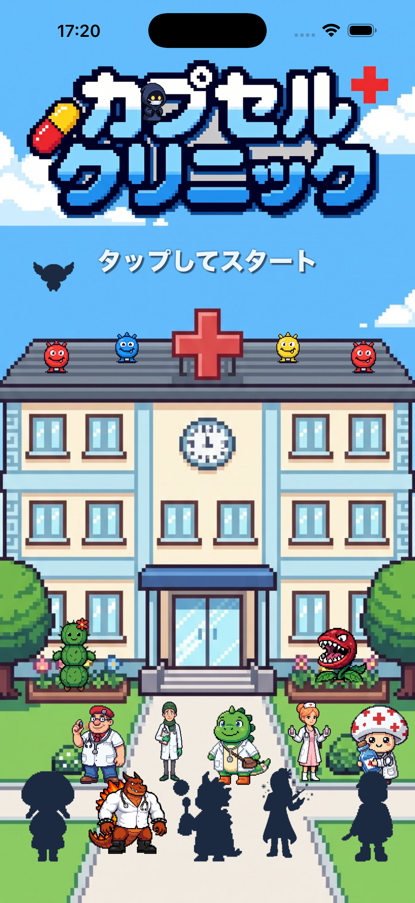
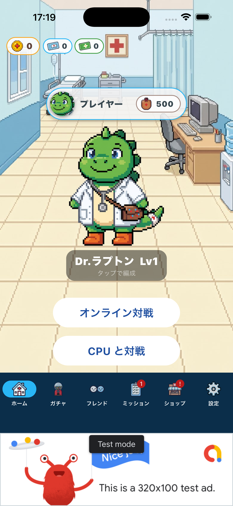
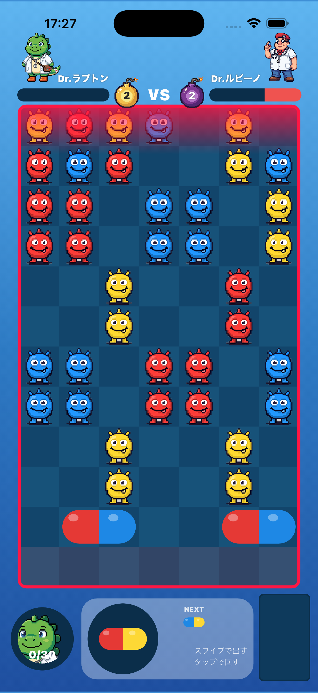
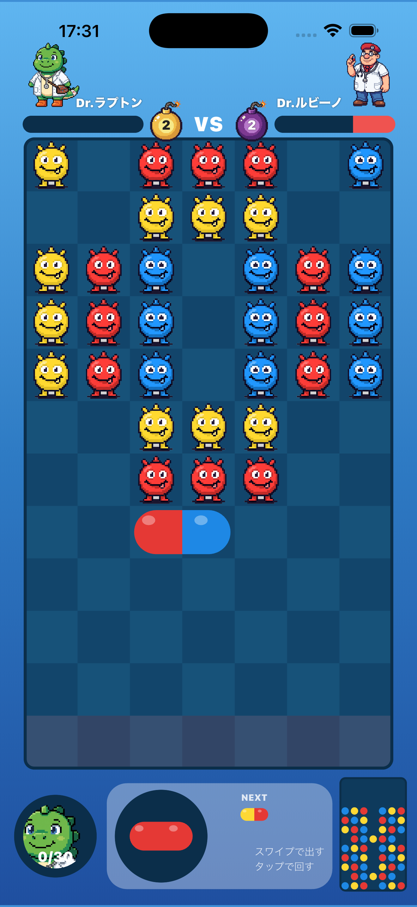
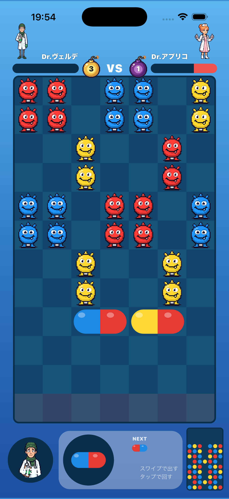
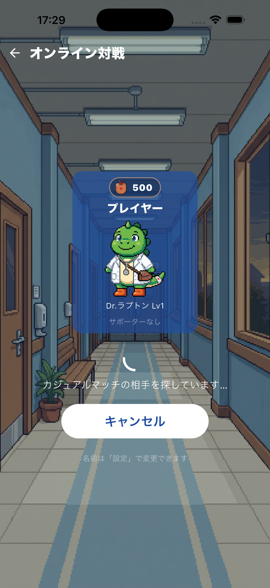

# カプセルクリニック

カプセルを積んでウイルスを消し、世界のドクターとリアルタイム対戦するパズルゲームです。

**このリポジトリは Android 版（APK）の配布専用です。** ゲーム本体のソースコードは含まれていません。

---

## ダウンロード

最新版は [Releases](../../releases/latest) から `capsule-clinic-x.y.z.apk` をダウンロードしてください。

| 項目 | 内容 |
|---|---|
| 対応 OS | Android 7.0（API 24）以降 |
| 価格 | 無料（アプリ内課金あり・広告あり） |
| 通信 | オンライン対戦にはインターネット接続が必要です |

### インストール方法

1. スマートフォンで Releases から APK をダウンロードします
2. 「提供元不明のアプリ」または「不明なアプリのインストール」の確認が出たら、ブラウザ（Chrome など）に許可を与えます
   - 設定 → アプリ → 特別なアプリアクセス → 不明なアプリのインストール
3. ダウンロードした APK を開いてインストールします

> Google Play から入手したアプリではないため、インストール時に警告が表示されます。これは Play ストア外の APK すべてに共通の表示です。

---

## 画面

| タイトル | ホーム | CPU 戦 |
|---|---|---|
|  |  |  |

| オンライン対戦 | オンライン対戦 | マッチング |
|---|---|---|
|  |  |  |

---

## 遊びかた

- **カプセルを出す** — 下の手持ちからスワイプ。タップで回転、指を離すとゆっくり浮上します
- **消す** — 同じ色を 3 つ以上そろえるとウイルスが消えます
- **攻撃** — まとめて消すと相手のフィールドにブロックを送り込めます
- **サドンデス** — 3 分が過ぎると上から鉄ブロックがせまり、フィールドが狭くなります

### モード

- **オンライン対戦** — ランクマッチ（ブロンズ〜マスターの 6 階級）とカジュアルマッチ
- **フレンド対戦** — ID でフレンドを検索して申請し、おたがいに選ぶと対戦開始
- **CPU 戦** — 5 段階の強さ。前の段階に勝つと次が開放されます
- **ガチャ** — 30 人のドクターとサポーターを集めて編成

---

## プライバシー

プライバシーポリシー: https://fafanfarth.github.io/dokumari-web/privacy.html

広告配信（Google AdMob）のために端末の広告識別子を使用します。また、アカウント（名前・ID・対戦成績）をサーバーに保存します。アカウントはアプリ内の設定画面から削除できます。

---

## お問い合わせ

不具合の報告やご要望は [Issues](../../issues) までお願いします。

---

## 権利について

本リポジトリで配布するアプリケーションおよび画像・音声などの素材の著作権は作者に帰属します。再配布・改変・リバースエンジニアリングはご遠慮ください。
